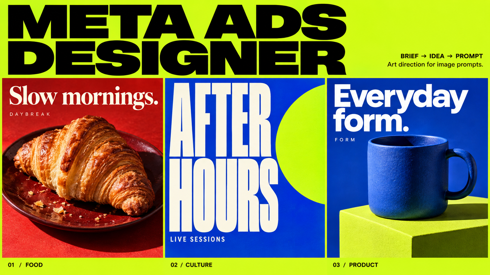
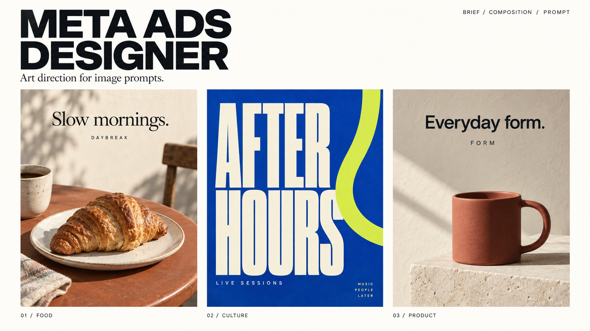
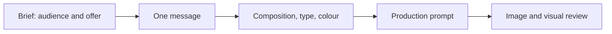

# Meta Ads Designer

### From a brief to an ad with a clear idea.

An AI agent skill for choosing **composition, typography, colour and visual direction**, then translating those decisions into precise image-generation prompts.

[Polski](README.md) · [Agent instructions](SKILL.md) · [Quick start](#quick-start) · [Examples](examples/README.md)




*AI-generated demonstration concepts: fictional cafe DAYBREAK, event AFTER HOURS and brand FORM. These illustrate design directions, not client campaigns or measured advertising performance. [Exact prompt and image notes](examples/06-readme-showcase.md).*

## What the skill does

It helps an agent decide what the viewer should understand, where the eye lands first, how copy fits the frame, and whether photography, illustration or typography best serves the message.

Use it for social ads, flyers, posters, product photography and campaign concepts. Request a prompt alone or pair it with an image-generation tool. The design guidance is model-independent.

## See the decisions behind the result

| Brief | Design decision | What the visual demonstrates |
|---|---|---|
| Cafe: invite a relaxed breakfast visit | Close framing, natural light, short serif headline | One appetising product with a clear image/type rhythm |
| Music event: make the name memorable | Name as hero, condensed type, strong contrast | A flyer that works without a photograph |
| Ceramics: show the object's form | Large silhouette, restrained palette, directional shadow | Shape and material leading the composition |

Each creative has its own visual language. Hierarchy and intentional choices connect them.

The same concepts can also take a quieter editorial direction:



*A second demonstration board. The art direction changes; the skill is not restricted to either style.*

## How it works



1. **Brief** — establish audience, verified offer, goal, format and available assets.
2. **Idea** — choose what makes the benefit visible: product, action, detail, situation or type.
3. **Art direction** — define the focal element, reading order, copy space, fonts and palette.
4. **Prompt** — write the composition, exact copy and relevant constraints.
5. **Review** — check prompt consistency; once rendered, inspect readability, spelling and reference fidelity.

Prompt-only requests stop at prompt review. The agent does not score an image it has not seen.

## Quick start

### In a chat

Paste [core.md](core.md) as an instruction or add it as conversation material. Then give a short brief:

> Write a prompt for a 4:5 ad for my cafe. Audience: people looking for breakfast nearby. I have attached a croissant photo and logo. Goal: encourage visits. Headline: “Slow mornings.” Choose composition, typography and colour. Preserve the product and logo. Do not add unverified prices or promotions.

### As an agent skill

Clone the repository and place the whole directory in your agent's skills folder:

```bash
git clone https://github.com/aievolutionpl/meta-ads-designer.git
```

[SKILL.md](SKILL.md) is the entrypoint. See [INSTALL.md](INSTALL.md) for host-specific setup.

## What helps reduce AI-slop

- **One dominant element.** Product, event name or offer comes before decoration.
- **Typography with a role.** Specify family, weight, width, line breaks and hierarchy.
- **Brand-led colour.** Choose palette and style for the brief rather than applying one premium look everywhere.
- **Authentic source assets.** References define the product, venue and identity.
- **Supported copy.** No invented reviews, prices, deadlines or results.
- **Specific revisions.** Fix the composition or message rather than adding “more beautiful, cinematic, 8K”.

## Text and logos

Short copy can be generated with the ad and inspected afterwards. When exact fonts, diacritics, prices or official logos matter, the skill supports separate typesetting: an image with planned copy space plus a composition specification.

A prompt communicates intent. It cannot guarantee identical fonts, pixel coordinates or perfect spelling in every tool.

## Repository guide

| Resource | Purpose |
|---|---|
| [SKILL.md](SKILL.md) | Agent instructions and resource routing |
| [core.md](core.md) | Self-contained chat instruction |
| [Art direction](references/art-direction.md) | Marketing goal to composition and typography |
| [Prompt craft](references/prompt-craft.md) | Writing and reviewing prompts |
| [Worked prompts](examples/05-model-independent-directions.md) | Flyer, food and local service |
| [Visual Advertising Engine](visual-advertising-engine.md) | Canonical rules R01–R44 |
| [Layout system](references/layout-system.md) | Starting values for grids, margins and type |
| [QA gate](references/qa-gate.md) | Reviewing actual rendered images |
| [More examples](examples/README.md) | Briefs, prompts and design decisions |

## Validation and contributions

```bash
pip install -r requirements.txt
python scripts/check_docs.py
python scripts/test_qa.py
```

Documentation checks validate links, rule references and versions. Image QA measures selected technical properties; composition, credibility and brief fidelity need separate review. Campaign performance requires measurement after publication.

See [CONTRIBUTING.md](CONTRIBUTING.md) and [CHANGELOG.md](CHANGELOG.md).

---

Created by **AI Evolution Labs** · [MIT License](LICENSE) · [aievolutionlabs.io](https://aievolutionlabs.io/)
