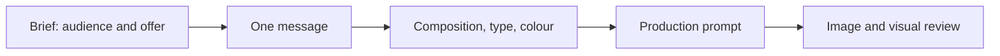

# Meta Ads Designer

### From a brief to an ad with a clear idea.

An AI agent skill for choosing **composition, typography, colour and visual direction**, then translating those decisions into precise image-generation prompts.

[Polski](README.md) · [Agent instructions](SKILL.md) · [Quick start](#quick-start) · [Examples](examples/README.md)


| | | |
|---|---|---|
|  |  |  |

*Fully AI-generated from the skill's prompts: no retouching, no code overlays. Brands are fictional. [Prompts, analysis and round 2](examples/08-generated-showcase.md).*

## What the skill does

It helps an agent decide what the viewer should understand, where the eye lands first, how copy fits the frame, and whether photography, illustration or typography best serves the message.

Use it for social ads, flyers, posters, product photography and campaign concepts. Request a prompt alone or pair it with an image-generation tool. The design guidance is model-independent.

## See the decisions behind the result

| Brief | Design decision | What the visual demonstrates |
|---|---|---|
| Cafe: invite a relaxed breakfast visit | Close framing, natural light, short serif headline | One appetising product with a clear image/type rhythm |
| Music event: make the name memorable | Name as hero, condensed type, strong contrast | A flyer that works without a photograph |
| Ceramics: show the object's form | Large silhouette, restrained palette, directional shadow | Shape and material leading the composition |

Each creative has its own visual language. Hierarchy and intentional choices connect them.

The same concepts can also take a quieter editorial direction:


*A second demonstration board. The art direction changes; the skill is not restricted to either style.*

## New in 6.0: research, questions, AI generation

- **Always generated by AI from scratch.** Every final ad comes out of an image model (API, Codex or the host's tool), headline and layout included. No HTML or coded composition (R50).
- **Research first, then questions.** The agent checks the brand's site, Meta Ad Library, competitors and reviews, then asks 3–6 sharp questions at once, each with a default, and writes prompts from a decision note (R51).
- **Analysis after generation.** The agent transcribes every word in the image, checks product and logo fidelity, runs the thumbnail test and changes one decision per iteration.

### The 2026 layer

The skill now knows what current Meta ads look like and why some structures persuade:

- **Style atlas 2026** — sixteen visual languages, from oversized type posters and direct-flash editorial to notes-app natives, performance stickers and tactile zines, each with its type, colour, signature device, a prompt fragment and the way it fails.
- **Static formats** — fifteen persuasion skeletons (stat drop, review stack, product + callouts, comparison, offer stack…), each available only when its proof exists.
- **2026 platform facts** — Meta's unified Reels/Stories safe zone (14% top, 35% bottom), 4:5 export at 1440×1800, Advantage+ image expansion and generated backgrounds, "AI info" labels, and Andromeda's grouping of near-identical ads.
- **Four new rules, R45–R48** — one visual language per ad, format follows proof, diversity is delivery, design for the 2026 placement system.

## How it works



1. **Research and questions** — study the brand, Ad Library and competitors, ask 3–6 questions, write a decision note.
1. **Brief** — establish audience, verified offer, goal, format and available assets.
2. **Idea** — choose what makes the benefit visible: product, action, detail, situation or type.
3. **Art direction** — pick a format the proof supports and one visual language, then define the focal element, reading order, copy space, fonts and palette.
4. **Prompt** — write the composition, exact copy and relevant constraints.
5. **Review** — check prompt consistency; once rendered, inspect readability, spelling and reference fidelity.

Prompt-only requests stop at prompt review. The agent does not score an image it has not seen.

## Quick start

### In a chat

Paste [core.md](core.md) as an instruction or add it as conversation material. Then give a short brief:

> Write a prompt for a 4:5 ad for my cafe. Audience: people looking for breakfast nearby. I have attached a croissant photo and logo. Goal: encourage visits. Headline: “Slow mornings.” Choose composition, typography and colour. Preserve the product and logo. Do not add unverified prices or promotions.

### As an agent skill

Clone the repository and place the whole directory in your agent's skills folder:

```bash
git clone https://github.com/aievolutionpl/meta-ads-designer.git
```

[SKILL.md](SKILL.md) is the entrypoint. See [INSTALL.md](INSTALL.md) for host-specific setup.

## What helps reduce AI-slop

- **One dominant element.** Product, event name or offer comes before decoration.
- **Typography with a role.** Specify family, weight, width, line breaks and hierarchy.
- **Brand-led colour.** Choose palette and style for the brief rather than applying one premium look everywhere.
- **Authentic source assets.** References define the product, venue and identity.
- **Supported copy.** No invented reviews, prices, deadlines or results.
- **Specific revisions.** Fix the composition or message rather than adding “more beautiful, cinematic, 8K”.

## Text and logos

The whole ad, text included, is generated by the AI model. The skill quotes exact copy with correct diacritics, gives hierarchy and position, and passes the logo and product as reference images. After generation the agent transcribes every word. On an error it regenerates or runs a targeted edit with the same model instead of overlaying text in code.

## Repository guide

| Resource | Purpose |
|---|---|
| [SKILL.md](SKILL.md) | Agent instructions and resource routing |
| [core.md](core.md) | Self-contained chat instruction |
| [Art direction](references/art-direction.md) | Marketing goal to composition and typography |
| [Prompt craft](references/prompt-craft.md) | Writing and reviewing prompts |
| [Discovery and research](references/discovery-and-research.md) | Research, pre-generation questions, decision note, result analysis |
| [Style atlas 2026](references/style-atlas-2026.md) | Sixteen visual languages, trend slop, reading reference boards |
| [Static ad formats](references/static-ad-formats.md) | Persuasion skeletons, proof, funnel and vertical fit |
| [Worked prompts](examples/05-model-independent-directions.md) | Flyer, food and local service |
| [2026 style directions](examples/07-2026-style-directions.md) | Format plus style briefs and an Andromeda-ready campaign set |
| [Visual Advertising Engine](visual-advertising-engine.md) | Canonical rules R01–R52 |
| [Layout system](references/layout-system.md) | Starting values for grids, margins and type |
| [Creative diagnostics](references/creative-diagnostics.md) | From an Ads Manager export to the next brief (`scripts/creative_diagnostics.py`) |
| [Platform guidance](references/platform-compliance.md) | Safe zones, text limits, Advantage+, AI labels |
| [QA gate](references/qa-gate.md) | Reviewing actual rendered images |
| [More examples](examples/README.md) | Briefs, prompts and design decisions |

## Validation and contributions

```bash
pip install -r requirements.txt
python scripts/check_docs.py
python scripts/test_qa.py
python scripts/test_diagnostics.py
```

Documentation checks validate links, rule references and versions. Image QA measures selected technical properties; composition, credibility and brief fidelity need separate review. Campaign performance requires measurement after publication.

See [CONTRIBUTING.md](CONTRIBUTING.md) and [CHANGELOG.md](CHANGELOG.md).

---

Created by **AI Evolution Labs** · [MIT License](LICENSE) · [aievolutionlabs.io](https://aievolutionlabs.io/)
