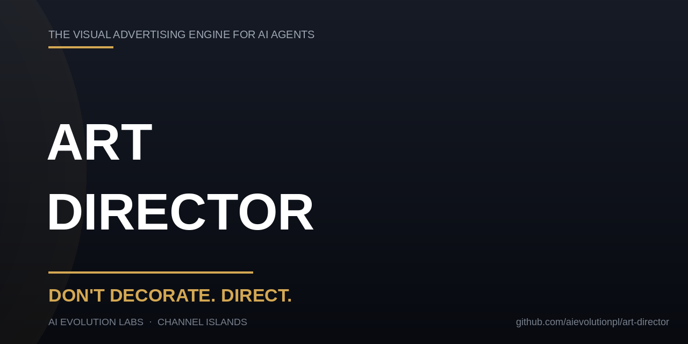

<div align="center">

# 🎬 Art Director

### The visual advertising engine for AI agents — stop generating AI-slop, start generating campaigns.

**Posters · Flyers · Meta Ads · Product photography · E-commerce visuals** — for restaurants, hotels, local businesses and retail.

[🇵🇱 Polski](README.pl.md) · [EN](README.md)


<br/>

> **„Don't generate objects in a void. Generate ads that look like a campaign — with hierarchy, typography, real light, and a structural message."**

> **`DON'T DECORATE. DIRECT.`** — One product. One idea. One strong visual.

<br/>



<br/>

</div>

---

## 🧩 The problem — why AI ads all look the same

Image models have **no taste**. Left to themselves they converge on a look anyone can spot as AI-slop:

| 🐘 What the user sees | ➡️ What the model produces |
|-----------------------|----------------------------|
| A real business, with real photos | Tiny clip-art icons, no composition |
| Their actual food / venue / product | AI-**invented** dishes, fake facades |
| Their real logo | A distorted AI-**redrawn** logo |
| A premium local restaurant | A generic purple-blue gradient + Inter font |
| A memorable offer | Text slapped on a photo (Canva template), no message |

The result reads as *"an image from ChatGPT"* — not a professional campaign. **Art Director fixes that.**

---

## 🚀 Try it right now (no install)

**Option A — one paste.** Put the contents of **[`core.md`](core.md)** into ChatGPT / Claude / Gemini as a custom instruction, then prompt:

> *"Make a 4:5 social ad for my coffee shop. Here are my reference photos: [attach logo + drinks]. Follow the Art Director rules — product first, real food from my photos, my logo unaltered, one headline readable from a thumbnail, no text-on-photo slop. Show me 3 structurally different concepts."*

**Option B — as a skill** (Hermes / Claude Code / Codex / Cursor):
```bash
git clone https://github.com/aievolutionpl/art-director.git
cp -r art-director ~/.hermes/skills/marketing/   # or ~/.claude/skills/ ~/.codex/skills/ ~/.cursor/skills/
```

**Verify it loaded** — ask the agent to *"summarize the Art Director rules"*. It should name product-first, source of truth, commercial realism, hierarchy, negative space, anti-slop, hard fails. If it recites generic "make it premium", it didn't load — re-paste.

Full per-host steps: **[`INSTALL.md`](INSTALL.md)**.

---

## ✨ Why it works on any agent

`Art Director` is **framework-agnostic**. The same rules travel everywhere — native skills on Hermes/Claude/Codex/Cursor, custom instructions on ChatGPT, or system-prompt injection on any agent/API.

```
┌────────────────────────────────────────────┐
│ visual-advertising-engine(.en).md          │  ← THE standard (34 rules)
│   Product First · Source of Truth ·        │     Prompt Architecture ·
│   Hard Fails · Final Quality Check         │     Creative Workflow
└───────────────┬────────────────────────────┘
                │ summarized as
                ▼
┌─────────────────────────────┐
│      design-rules(.en).md   │  ← THE charter (paste-able taste)
│   "The Rules of Beautiful   │     Works on ANY agent
│    Advertising"             │
└───────────────┬─────────────┘
                │ loaded by
        ┌───────┼───────┐
        ▼       ▼       ▼
   ┌────────┐ ┌───────┐ ┌──────────────┐
   │SKILL.md│ │core.md│ │  references/ │
   │ manual │ │inject │ │ depth:       │
   │        │ │me 1-pg│ │ prompts,     │
   └────────┘ └───────┘ │ niches, slop │
                        └──────────────┘
```

**The split is intentional:** the *standard* (what an agent follows) → the *charter* (the taste, paste-able) → the *manual* (procedure) → the *core* (one-page inject) → the *references* (depth). Taste travels; procedure adapts.

---

## 🏛️ The Rules of Beautiful Advertising

Full 34-rule standard in **`visual-advertising-engine.md`**. Headlines:

> **Product First · Reference = Source of Truth · One creative = One idea · Don't decorate, direct.**

1. **Hierarchy** — one dominant element (the product / title), readable from a thumbnail, message in 1 second.
2. **Real typography** — name real typefaces (Playfair, Montserrat…), max 3 families, contrast by weight & scale. Never "modern sans-serif".
3. **Brand palette + one accent** — never the purple-blue default; no cream/sand "for warmth"; gradient only as a scrim.
4. **Negative space** — generous margins, breathing room; space is luxury.
5. **Imagery in context** — product in real use, real light, real people. Never floating on a void.
6. **Real food from refs** — never let AI invent dishes the venue doesn't serve.
7. **Logo fidelity** — never AI-redraw an official logo; place the original file.
8. **Ad spine** — headline → subline → CTA → brand cue. A pretty photo is not an ad.
9. **No AI copy** — banned words (delve, seamless, empower, elevate, robust, revolutionary, 🚀); names & numbers over adjectives.
10. **QA before shipping** — thumbnail readability, correct spelling (incl. Polish diacritics), one focal point, contrast, logo fidelity.

Plus, from the Engine: **Commercial realism** (perspective, gravity, shadows, real materials) · **Lighting is part of the product** · **Think like a photographer** · **Build depth** · **Three mandatory angles** (Problem/Effect/Lifestyle) · **The Visual Creative Library** (hero, packshot, lifestyle, product-in-use, macro, problem/solution, result, UGC, editorial, scroll-stopper) · **Series consistency** · **Hard Fail Conditions** · **DON'T DECORATE. DIRECT.**

---

## 🧠 The workflow it drives

```
1. BRIEF     — what we promote, for whom, the CTA, platforms + collect refs
2. RESEARCH  — how do top brands in this niche present themselves? If the
               client has ads they like — that IS the style source of truth
3. ANGLES    — 5-10 distinct promises/layouts, not 10 color swaps
4. CREATIVE  — product → benefit → target → angle → metaphor → type →
               composition → light/camera → constraints → then the prompt
5. GENERATE  — one finished ad per generation; refs with a clear role
6. QA        — contact sheet + checklist; scale+pad (never crop) near edges
7. DELIVER   — files + contact sheet + notes; report model/cost
```

---

## 📁 Repo structure

```
art-director/
├── SKILL.md                        # Agent operating manual (procedure + routing)
├── core.md                         # 1-page injectable rules — paste into any chat
├── visual-advertising-engine.md    # THE standard — 34 rules (PL)
├── visual-advertising-engine.en.md # THE standard — 34 rules (EN)
├── design-rules.md                 # The charter — Rules of Beautiful Advertising (PL)
├── design-rules.en.md              # The charter (EN)
├── INSTALL.md                      # Setup + usage on every agent (incl. ChatGPT)
├── README.md                       # This manual (EN)
├── README.pl.md                    # This manual (PL)
├── LICENSE                         # MIT
└── references/
    ├── anti-slop-registry.md       # Full banned-pattern compendium (visual + copy)
    ├── niche-playbooks.md          # Per-industry ad playbooks (restaurant, hotel, …)
    └── prompt-library.md           # Ready-to-use prompt recipes for any model
```

---

## 🧭 File map

| File | Use it for |
|------|-----------|
| `core.md` | **The one-page inject** — paste into any chat/agent |
| `visual-advertising-engine(.en).md` | **The operating standard** — 34 rules agents follow before any commercial visual |
| `design-rules(.en).md` | The charter — the taste |
| `SKILL.md` | Agent operating manual (skill loaders read this) |
| `INSTALL.md` | Setup per host |
| `references/prompt-library.md` | Ready-to-use prompt recipes |
| `references/niche-playbooks.md` | Per-industry depth |
| `references/anti-slop-registry.md` | Full banned-pattern list + grep gate |
| `README.md` | This manual |

---

## 🤝 Contributing

Have a rule that would've saved a campaign? Open a PR against `visual-advertising-engine.md` — it's the canonical source; `core.md`, `SKILL.md` and the README summarize it. See [`CONTRIBUTING.md`](CONTRIBUTING.md).

---

## 📜 License

MIT — use it, remix it, ship it.

---

<br/>
<div align="center">
  <b>Created by</b><br/>
  <b>AI EVOLUTION LABS</b><br/>
  <sub>Channel Islands</sub><br/>
  <sub><a href="https://github.com/aievolutionpl/art-director">github.com/aievolutionpl/art-director</a></sub>
</div>
