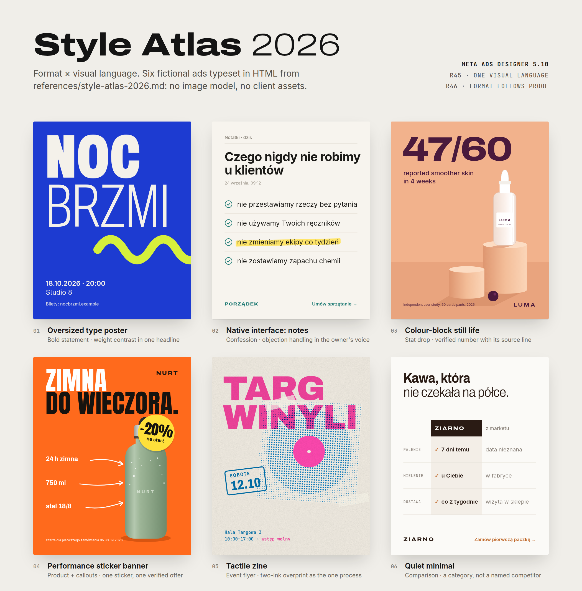
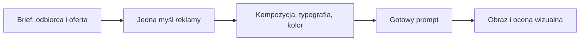

# Meta Ads Designer

### Od briefu do reklamy z wyraźnym pomysłem.

Skill dla agentów AI, który pomaga dobierać **kompozycję, typografię, kolor i kierunek wizualny**, a następnie zapisywać te decyzje w precyzyjnych promptach do generowania obrazów.

[English](README.en.md) · [Instrukcja skilla](SKILL.md) · [Szybki start](#szybki-start) · [Przykłady](examples/README.md)


*Koncepcje demonstracyjne wygenerowane z art-directed promptu: fikcyjna kawiarnia DAYBREAK, wydarzenie AFTER HOURS i marka FORM. To ilustracja kierunków projektowych, nie kampanie klientów ani dowód skuteczności reklamowej. [Prompt i opis grafiki](examples/06-readme-showcase.md).*

## Co robi ten skill

Pomaga agentowi odpowiedzieć na pytania, które decydują o wyglądzie reklamy: co widz ma zrozumieć, na co spojrzy najpierw, jak ułożyć tekst i kiedy wybrać fotografię, ilustrację albo plakat typograficzny.

Działa przy tworzeniu reklam social media, flyerów, posterów, fotografii produktowej i koncepcji kampanii. Możesz zamówić sam prompt lub użyć go razem z narzędziem generowania obrazów. Wiedza projektowa jest niezależna od modelu.

## Zobacz, skąd bierze się efekt

| Brief | Decyzja projektowa | Co pokazuje grafika |
|---|---|---|
| Kawiarnia: zachęcić do spokojnego śniadania | Bliski kadr, naturalne światło, krótki nagłówek szeryfowy | Jeden apetyczny produkt i czytelny rytm obrazu oraz tekstu |
| Wydarzenie muzyczne: zwrócić uwagę na nazwę | Nazwa jako dominanta, skondensowany krój, mocny kontrast | Flyer, który działa bez zdjęcia |
| Ceramika: pokazać formę przedmiotu | Duża sylwetka, stonowana paleta, kierunkowy cień | Materiał i kształt prowadzą kompozycję |

Każda kreacja ma własny język wizualny. Łączy je hierarchia i świadomy dobór elementów.

Ten sam zestaw pomysłów można rozwinąć w spokojniejszym kierunku editorial:


*Druga plansza demonstracyjna. Zmienia się charakter art direction, a nie zakres możliwości skilla.*

## Nowość w 5.10: warstwa 2026



*Sześć fikcyjnych reklam złożonych deterministycznie w HTML ([źródło](assets/generated/style-atlas.html)): bez modelu obrazu, bez materiałów klientów, bez obietnic wyników. Każda łączy format perswazji z jednym językiem wizualnym.*

Skill wie teraz, jak wyglądają aktualne reklamy Meta i dlaczego pewne struktury przekonują:

- **Atlas stylów 2026** — dwanaście języków wizualnych: od plakatu z wielką typografią i edytorialu z fleszem, przez natywne notatki, banery performance ze stickerem, po taktylny zin. Każdy ma typografię, kolor, sygnaturowy detal, fragment promptu i typowy błąd.
- **Formaty statyczne** — piętnaście szkieletów perswazji (stat drop, stos recenzji, produkt z calloutami, porównanie, offer stack…). Format jest dostępny tylko wtedy, gdy istnieje jego dowód.
- **Fakty platformy 2026** — ujednolicona strefa bezpieczna Reels/Stories (14% góra, 35% dół), eksport 4:5 w 1440×1800, rozszerzanie obrazu i generowane tła w Advantage+, etykiety „AI info” oraz grupowanie niemal identycznych reklam przez Andromedę.
- **Cztery nowe reguły, R45–R48** — jeden język wizualny na reklamę, format wynika z dowodu, różnorodność daje zasięg, projekt pod system placementów 2026.

## Jak działa



1. **Brief** — agent ustala odbiorcę, prawdziwą ofertę, cel, format i dostępne materiały.
2. **Pomysł** — wybiera, co pokaże korzyść: produkt, działanie, detal, sytuacja lub typografia.
3. **Art direction** — wybiera format, na który pozwala dowód, i jeden język wizualny, a potem określa dominantę, kolejność czytania, przestrzeń na tekst, fonty i paletę.
4. **Prompt** — zapisuje konkretną kompozycję, dokładne treści i ograniczenia.
5. **Ocena** — sprawdza spójność promptu; po wygenerowaniu obrazu również czytelność, pisownię i zgodność z materiałami.

Jeśli prosisz tylko o prompt, praca kończy się na jego sprawdzeniu. Agent nie ocenia obrazu, którego nie widział.

## Szybki start

### W zwykłym czacie

Wklej [core.md](core.md) jako instrukcję lub dodaj go jako materiał do rozmowy. Potem podaj krótki brief:

> Przygotuj prompt do reklamy 4:5 mojej kawiarni. Odbiorcy: osoby szukające śniadania w okolicy. Załączam zdjęcie croissanta i logo. Cel: zachęcić do wizyty. Nagłówek: „Poranek ma warstwy.” Dobierz kompozycję, typografię i kolor. Zachowaj wygląd produktu i logo. Nie dodawaj niepotwierdzonych cen ani promocji.

### Jako skill dla agenta

Sklonuj repozytorium i umieść cały katalog w katalogu skilli swojego agenta:

```bash
git clone https://github.com/aievolutionpl/meta-ads-designer.git
```

Instrukcją wejściową jest [SKILL.md](SKILL.md). Szczegóły dla poszczególnych hostów znajdziesz w [INSTALL.md](INSTALL.md).

## Co pomaga ograniczyć AI-slop

- **Jedna dominanta.** Produkt, nazwa wydarzenia lub oferta ma pierwszeństwo przed dekoracją.
- **Typografia z rolą.** Konkretny krój, ciężar, szerokość, układ wierszy i hierarchia.
- **Kolor wynikający z marki.** Palety i style są dobierane do briefu; nie ma jednego „premium looku” dla wszystkich.
- **Prawdziwe materiały.** Referencje określają wygląd produktu, lokalu i identyfikacji.
- **Treść bez zmyślonych faktów.** Żadnych fikcyjnych opinii, cen, terminów czy wyników.
- **Korekta konkretnego problemu.** Agent poprawia kompozycję albo komunikat zamiast dopisywać „bardziej pięknie, cinematic, 8K”.

## Tekst i logo w reklamie

Dla krótkich treści można poprosić generator o gotową reklamę i sprawdzić jej pisownię. Gdy liczą się dokładny font, polskie znaki, cena lub oficjalne logo, skill przewiduje osobny skład: obraz z zaplanowanym miejscem na tekst oraz specyfikację typografii.

Prompt wyraża intencję projektową. Nie gwarantuje identycznego fontu, położenia co do piksela ani bezbłędnej pisowni w każdym narzędziu.

## Materiały w repozytorium

| Materiał | Do czego służy |
|---|---|
| [SKILL.md](SKILL.md) | Instrukcja agenta i dobór materiałów |
| [core.md](core.md) | Samodzielna instrukcja do wklejenia w czacie |
| [Art direction](references/art-direction.md) | Od celu marketingowego do kompozycji i typografii |
| [Prompt craft](references/prompt-craft.md) | Pisanie i sprawdzanie promptów |
| [Atlas stylów 2026](references/style-atlas-2026.md) | Dwanaście języków wizualnych, trend slop, czytanie plansz referencyjnych |
| [Formaty statyczne](references/static-ad-formats.md) | Szkielety perswazji, dowód, lejek i dopasowanie do branży |
| [Przykłady promptów](examples/05-model-independent-directions.md) | Flyer, gastronomia i usługa lokalna |
| [Kierunki 2026](examples/07-2026-style-directions.md) | Briefy „format + styl” i zestaw kampanii pod Andromedę |
| [Visual Advertising Engine](visual-advertising-engine.md) | Kanoniczne reguły R01–R49 |
| [Layout system](references/layout-system.md) | Punkty wyjścia dla siatki, marginesów i skali tekstu |
| [Diagnostyka kreacji](references/creative-diagnostics.md) | Z eksportu Ads Managera do kolejnego briefu (`scripts/creative_diagnostics.py`) |
| [Platformy](references/platform-compliance.md) | Strefy bezpieczne, limity tekstu, Advantage+, etykiety AI |
| [QA gate](references/qa-gate.md) | Ocena rzeczywiście wygenerowanych obrazów |
| [Pozostałe przykłady](examples/README.md) | Briefy, prompty i omówienie decyzji |

## Weryfikacja i rozwój

```bash
pip install -r requirements.txt
python scripts/check_docs.py
python scripts/test_qa.py
python scripts/test_diagnostics.py
```

Kontrole dokumentacji sprawdzają linki, odwołania do reguł i wersje. Skrypt QA bada wybrane cechy techniczne obrazu; ocenę kompozycji, wiarygodności i zgodności z briefem trzeba wykonać osobno. Wyniki kampanii wymagają pomiaru po publikacji.

Zasady współpracy: [CONTRIBUTING.md](CONTRIBUTING.md). Historia zmian: [CHANGELOG.md](CHANGELOG.md).

---

Created by **AI Evolution Labs** · [MIT License](LICENSE) · [aievolutionlabs.io](https://aievolutionlabs.io/)
