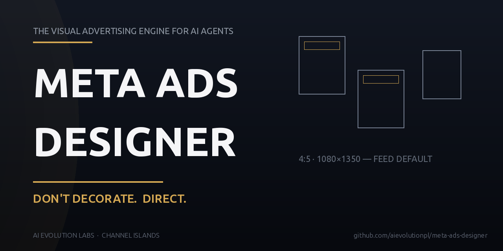

<div align="center">

# 🎬 Meta Ads Designer

### Uniwersalny standard reklamy dla agentów AI — projektuj piękne Meta / Instagram / Facebook adsy i przestań generować AI-slop.

**Meta Ads · Instagram · Facebook · Postery · Flyery · Fotografia produktowa · Grafiki e-commerce** — dla restauracji, hoteli, lokalnych biznesów i retailu.

[🇬🇧 English](README.en.md) · [🇵🇱 Polski](README.md)


-informational)


<br/>



> **Domyślny format: 4:5 (1080×1350)** — feed Instagram/Facebook. Użytkownik może poprosić o inny ratio; 4:5 to default.

> **`DON'T DECORATE. DIRECT.`** — Jeden produkt. Jedna idea. Jeden mocny visual.

<br/>

</div>

---

## 🧩 Problem — dlaczego AI adsy wyglądają tak samo

Modele obrazowe **nie mają gustu**. Pozostawione same sobie zbiegają do jednego „AI looku" — i ten look **zawsze wygląda tak samo**, niezależnie czy robisz reklamę restauracji, hotelu czy serwisu naprawczego. Oto co realnie produkują, gdy nie damy im zasad:

| 🐘 Co robi „goły" model | ➡️ Jak to wygląda w praktyce |
|------------------------|------------------------------|
| **Słaba typografia** | Czcionki bez nazwy, „renderowane" zamiast dobranych; literówki i bełkot zamiast słów; Inter jako domyślna fonta wszędzie. |
| **Każdy obrazek ten sam** | Ten sam purple-blue gradient, te same pozy, te same twarze — reklama pizzerii i reklama kancelarii wyglądają identycznie. |
| **Małe ikonki clip-art** | Zawsze źle osadzone, pikselozowate, bez stylu — psują każdą generację. |
| **Za dużo tekstu** | Akapity naklejone na zdjęcie, nieczytelne z telefonu; nic nie jest komunikatem. |
| **Wszystko pachnie AI-slopem** | Neonowe glow, pseudo-interfejsy, hologramy, generyczne gradienty — „obrazek od ChatGPT", nie kampania. |
| **Zmienia Twoje zdjęcia** | Twarze ludzi, wnętrza lokalu i fasady nie przypominają prawdziwych — klient nie rozpoznaje własnego biznesu. |
| **Wymyśla / halucynuje** | Danie, którego nie ma w menu; logo „AI-redrawn"; fikcyjne napisy na szyldach i cenówki, które nie istnieją. |
| **Brak hierarchii** | Z miniaturki telefonu nie widać ani produktu, ani CTA — ad ginie w feedzie. |

**Efekt brzmi jak „obrazek od ChatGPT" — nie jak profesjonalna kampania.**

### ✅ Co Meta Ads Designer zmienia

Skill **zastępuje ten brak gustu regułami operacyjnymi** — tak jak zrobiłby to art director, fotograf reklamowy i media buyer, gdybyś wynajął ich do jednej kampanii:

- **Produkt jest bohaterem** — rozpoznawalny w ~1 s, dobrze oświetlony, pierwszy plan.
- **Twoje zdjęcia to Święta Prawda** — skill **nie pozwala** zmieniać twarzy, wnętrz, dań ani logo. Używa ich, nie przerabia.
- **Realna typografia** — nazwane fonty, max 3 rodziny, kontrast wagą i skalą; żadnych literówek.
- **Jedna idea na kreatywę** — przekaz czytelny z miniaturki telefonu.
- **Jakość jak od zespołu** — produkt, źródło, realizm komercyjny, hierarchia, anti-slop, QA przed wysyłką.

---

## 🚀 Wypróbuj teraz (bez instalacji)

**Opcja A — jedna wklejka.** Wklej zawartość **[`core.md`](core.md)** do ChatGPT / Claude / Gemini jako custom instruction, a potem wpisz:

> *„Zrób 4:5 social ad dla mojej kawiarni. Oto moje zdjęcia referencyjne: [logo + napoje]. Trzymaj się zasad — produkt na pierwszym planie, prawdziwe jedzenie z moich zdjęć, moje logo bez zmian, jeden headline czytelny z miniaturki, zero text-on-photo slopu. Pokaż 3 strukturalnie różne koncepty."*

**Opcja B — jako skill** (Hermes / Claude Code / Codex / Cursor):
```bash
git clone https://github.com/aievolutionpl/meta-ads-designer.git
cp -r meta-ads-designer ~/.hermes/skills/marketing/   # lub ~/.claude/skills/ ~/.codex/skills/ ~/.cursor/skills/
```

**Weryfikacja** — poproś agenta: *„podsumuj zasady"*. Powinien wymienić product-first, source of truth, commercial realism, hierarchię, negatywną przestrzeń, anti-slop, hard fails. Jeśli recytuje generyczne „make it premium" — nie wczytał; wklej ponownie.

Pełne kroki per host: **[`INSTALL.md`](INSTALL.md)**.

---

## ⚙️ Jak działa skill

`Meta Ads Designer` jest **framework-agnostic** — te same zasady działają na każdym agencie (ChatGPT, Claude, Codex, Hermes, Cursor, dowolny API). Zbudowany jest **warstwowo** — każda warstwa ma jedno zadanie i jedną drogę wejścia:

```
┌────────────────────────────────────────────┐
│ visual-advertising-engine.md               │  ← THE standard (34 zasady)
│   Product First · Source of Truth ·        │     Prompt Architecture ·
│   Hard Fails · Final Quality Check         │     Creative Workflow
└───────────────┬────────────────────────────┘
                │ podsumowany jako
                ▼
┌─────────────────────────────┐
│      design-rules.md       │  ← THE charter (wklejany gust)
│   "The Rules of Beautiful   │     Działa na KAŻDYM agencie
│    Advertising"             │
└───────────────┬─────────────┘
                │ ładowany przez
        ┌───────┼───────┐
        ▼       ▼       ▼
   ┌────────┐ ┌───────┐ ┌──────────────────┐
   │SKILL.md│ │core.md│ │  references/     │
   │ manual │ │wklejka│ │  głębia:         │
   │        │ │1 str. │ │  food/hotel/svc, │
   └────────┘ └───────┘ │  prompty, slop   │
                        └──────────────────┘
```

- **`visual-advertising-engine.md`** — *standard* (34 zasady). Co agent stosuje **przed** każdym komercyjnym visualem: Product First, Reference = Source of Truth, Prompt Architecture, Hard Fails, QA. **To jest źródło kanoniczne** — nowe reguły trafiają tu najpierw.
- **`design-rules.md`** — *charter* (gust). Angielski kanon. Samowystarczalny — wklejasz do dowolnego czatu lub wstrzykujesz do system promptu.
- **`core.md`** — *kompletna wiedza ogólna (inject)*. Formaty per platforma, proces kreatywny, kompozycja, typografia, kolor, światło, layout, copy, nisze, tryby produkcji, prompt architecture, anti-slop, hard fails, QA — samodzielny, wklejasz do dowolnego czatu.
- **`SKILL.md`** — *procedura* (agent manual). Brief → research → angles → creative → generate → QA → deliver. Loader skilli czyta frontmatter.
- **`references/`** — *głębia*: sprawdzony playbook food/hotel/serwisy, layout system, headline system, QA gate, gotowe prompty, pełny rejestr anti-slop.

### Dwa tryby produkcji (decyzja przed generacją)
| Tryb | Co to | Kiedy |
|------|-------|-------|
| **A · Natywny tekst AI** | Tekst **baked into** render AI, w scenie. Najlepsza pisownia: gpt-image-2 (Codex). Krótkie stringi. | Restauracja/venue/food — default. |
| **B · Kompozycja deterministyczna** | Generuj czyste tło, potem składaj ad (oficjalne logo + dokładna typografia + panele). | Gdy liczy się fidelity tekstu/logo (serwisy, oferty). |

### Workflow
```
1. BRIEF     — co, dla kogo, CTA, platformy (default 4:5) + zbierz refs
2. RESEARCH  — jak prezentują się topowe brandy w niszy?
3. ANGLES    — 5-10 różnych obietnic/layoutów, nie 10 color swaps
4. CREATIVE  — produkt → benefit → target → angle → metaphor → typ →
               kompozycja → światło/kamera → constraints → potem prompt
5. GENERATE  — jeden skończony ad per generacja
6. QA        — contact sheet + checklist; scale+pad (nigdy crop) przy krawędziach
7. DELIVER   — pliki + contact sheet + notki
```

---

## 🧭 Instrukcja dla agenta (dostałeś to repo? czytaj to)

To repo jest **skillem dla agentów** — dostaje je albo człowiek (żeby wkleić zasadę), albo sam agent (żeby działać). Jeśli jesteś agentem, który ma teraz **wygenerować ady**, oto jak się poruszać — od zera do gotowych plików:

**1. Wejdź w flow w tej kolejności (nie pomijaj):**
```text
core.md  →  SKILL.md  →  (szczegóły)  →  references/
 (1 min)     (pełna        reguły        (głębia tylko
             procedura)    standardu     gdy brief pasuje)
```

**2. Zasada „Source of Truth" działa na Ciebie:** zdjęcia od klienta = dokument techniczny. **Nie zmieniasz** twarzy, wnętrz, dań, logo, proporcji ani napisów. Możesz zmienić światło, kadr, perspektywę, scenografię, mood.

**3. Zanim wygenerujesz cokolwiek, odpowiedz na 4 pytania:**
- **Format?** Domyślny **4:5 (1080×1350)** — chyba że user jawnie prosi o inny (9:16 Reels, 1:1 marketplace, 16:9).
- **Refs?** Zebrałem wszystkie zdjęcia referencyjne klienta (produkt, lokal, dania, logo)? → wklej je, nie opisuj.
- **Tryb?** A (natywny tekst AI w scenie) czy B (deterministyczna kompozycja — czyste tło + skład w code)? Decyzja według tabeli wyżej.
- **Routing?** Który obszar repo dotyczy tego briefu:

| Brief | Czytaj |
|-------|--------|
| Restauracja / jedzenie / venue | `references/hospitality-food-services-playbook.md` + `layout-system.md` §3 |
| Hotel / lokal / obiekt | `references/hospitality-food-services-playbook.md` (real-photo + deterministyczna typografia) |
| Serwis / usługa | `references/hospitality-food-services-playbook.md` (serwisy) + tryb B (fidelity) |
| Retail / produkt | `examples/04-retail-product-in-use.md` + `layout-system.md` |
| Konkretna nisza | `references/niche-playbooks.md` |
| Nie wiem / coś nowego | `design-rules.md` + `visual-advertising-engine.md` |

**4. Pisz prompt jak fotograf reklamowy** — produkt → benefit → odbiorca → kąt → metafora → typ → kompozycja → światło/kamera → constraints. **Zakazane słowa** i anti-slop patterns: `references/anti-slop-registry.md`.

**5. QA przed wysyłką** — `references/qa-gate.md`: czytelność z miniaturki, poprawna pisownia, jeden focal point, logo fidelity, zero wymyślonych dań/fasad. **Nie wiesz, czy przechodzi QA?** Nie wysyłaj.

**6. Deliver** — pliki + contact sheet + krótkie notki co i dlaczego. Pokaż jakość, nie ilość.

---

## 🏛️ Zasady (skrót — pełny standard w Engine)

> **Product First · Reference = Source of Truth · One creative = One idea · Don't decorate, direct.**

1. **Hierarchia** — jeden dominujący element, czytelny z miniaturki, przekaz w 1s.
2. **Realna typografia** — nazwane fonty, max 3 rodziny, kontrast wagą i skalą; **nigdy** wyrenderowany bełkot zamiast słów.
3. **Paleta brandu + jeden akcent** — nigdy purple-blue default.
4. **Negatywna przestrzeń** — marże, oddech; przestrzeń = luksus.
5. **Imagery w kontekście** — produkt w realnym użyciu, realne światło, realni ludzie.
6. **Realne jedzenie z refs** — nigdy nie pozwól AI wymyślać dań, których lokal nie serwuje.
7. **Logo fidelity** — nigdy AI-redraw oficjalnego logo; wstaw oryginał.
8. **Ad spine** — headline → subline → CTA → brand cue. Piękne zdjęcie ≠ ad.
9. **Zero AI-copy** — zakazane słowa; nazwy i liczby zamiast przymiotników.
10. **QA przed wysyłką** — czytelność z miniaturki, poprawna pisownia, jeden focal point, logo fidelity.

**Więcej reguł, które robią różnicę:**
- **Commercial realism** — metal wygląda jak metal, grawitacja działa, cienie są. Fotografia, nie „generyczne 3D".
- **Lighting is part of the product** — światło jest elementem reklamy, nie przypadkiem.
- **Think like a photographer** — kadr, głębia, ujęcie zamiast „wygeneruj logo na gradient".
- **Build depth** — pierwszy plan / środek / tło; scena żyje.
- **Trzy obowiązkowe kąty** — Problem → Efekt → Lifestyle (dla produktów i usług).
- **Visual Creative Library** — zbieraj sprawdzone kompozycje; nie zaczynaj od zera za każdym razem.
- **Spójność serii** — ady w jednej kampanii to jedna rodzina, nie 10 przypadków.
- **Hard Fail Conditions** — konkretne rzeczy, które dyskwalifikują pracę: złe litery, fake logo, wymyślone dania, tekst nieczytelny z miniaturki.

---

## 📁 Struktura repo

```
meta-ads-designer/
├── SKILL.md                        # Manual agenta (procedura + routing)
├── core.md                         # Kompletna wiedza ogólna (inject) — wklej do dowolnego czatu
├── visual-advertising-engine.md    # THE standard — 34 zasady
├── design-rules.md                 # Charter (angielski kanon)
├── INSTALL.md                      # Setup + użycie na każdym agencie (w tym ChatGPT)
├── README.md                       # Ten manual (PL, główny)
├── README.en.md                    # Ten manual (EN, extra)
├── CHANGELOG.md                    # Historia wersji
├── LICENSE                         # MIT
├── assets/meta-ads-designer-banner.png
├── examples/                       # Gotowe przykłady adów (anti, restauracja, hotel, serwisy, retail)
├── scripts/                        # extract_wordmark.py, qa.py
└── references/
    ├── hospitality-food-services-playbook.md  # Głębia: food / hotel / serwisy
    ├── layout-system.md            # Layout + panel-heights + gradient values
    ├── headline-system.md          # Rozmiary headline i kontrast
    ├── qa-gate.md                  # Brama QA i kryteria odrzucenia
    ├── anti-slop-registry.md       # Kompletne kompendium zakazów (visual + copy)
    ├── niche-playbooks.md          # Playbooki per nisza
    └── prompt-library.md           # Gotowe prompty dla dowolnego modelu
```

---

## 🧭 File map

| Plik | Do czego |
|------|----------|
| `core.md` | Kompletna wiedza ogólna — wklej do dowolnego czatu/agenta |
| `visual-advertising-engine.md` | Standard operacyjny — 34 zasady (źródło kanoniczne) |
| `design-rules.md` | Charter — gust |
| `SKILL.md` | Manual agenta (czyta loader skilli) |
| `INSTALL.md` | Setup per host |
| `references/hospitality-food-services-playbook.md` | Głębokie reguły food / hotel / serwisy |
| `references/layout-system.md` | Layout + panele + gradienty |
| `references/headline-system.md` | Rozmiary headline i kontrast |
| `references/qa-gate.md` | Brama QA i kryteria odrzucenia |
| `references/anti-slop-registry.md` | Lista zakazów + grep gate |
| `references/niche-playbooks.md` | Głębia per nisza |
| `references/prompt-library.md` | Gotowe prompty |
| `README.md` | Ten manual (PL) |
| `README.en.md` | Ten manual (EN) |

---

## 🤝 Współpraca

Masz zasadę, która uratowałaby kampanię? Otwórz PR do `visual-advertising-engine.md` — to źródło kanoniczne. Zobacz [`CONTRIBUTING.md`](CONTRIBUTING.md).

---

## 📜 Licencja

MIT — używaj, remiksuj, publikuj.

---

<br/>
<div align="center">
  <b>Created by</b><br/>
  <b>AI EVOLUTION LABS</b><br/>
  <sub>Channel Islands</sub><br/>
  <sub><a href="https://github.com/aievolutionpl/meta-ads-designer">github.com/aievolutionpl/meta-ads-designer</a></sub>
</div>

---

## 🌐 Strony

- [aievolutionlabs.io](http://aievolutionlabs.io/)
- [aievolutionpolska.pl](https://www.aievolutionpolska.pl/)
