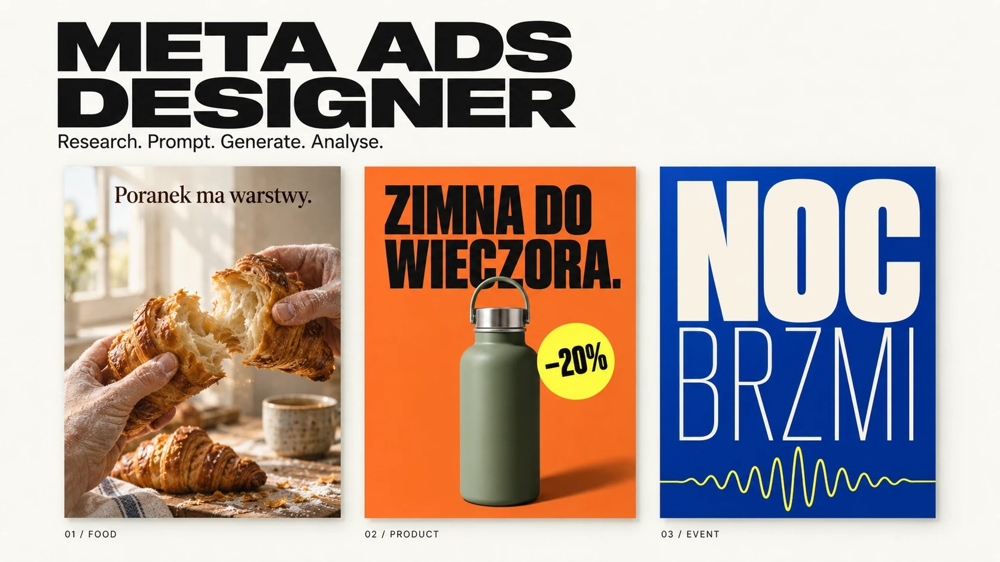
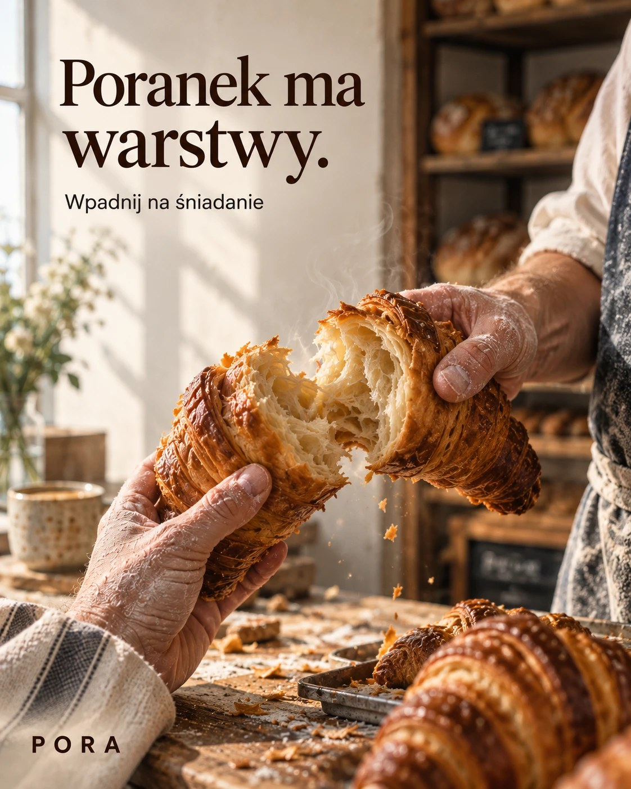
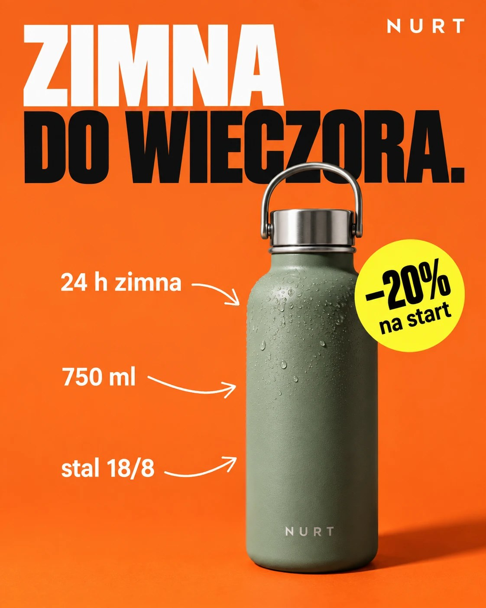
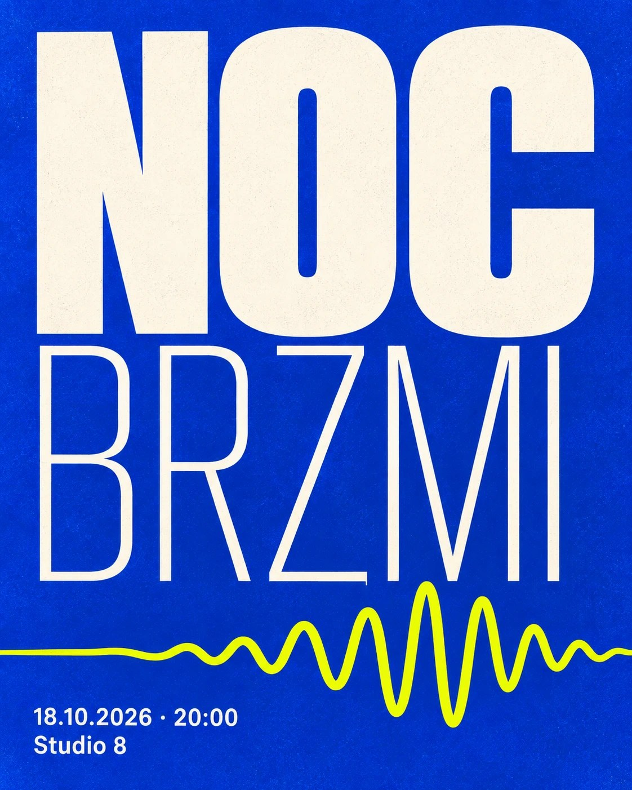

# Generated showcase: research → questions → prompt → image → analysis

This case produces the README showcase with an AI image model, following R50 and R51. All brands (PORA, NURT, NOC BRZMI) are fictional, and nothing here claims measured performance.

## 1 · Research note (abbreviated)

- Cafés in Kraków on Meta Ad Library mostly run plated dishes on dark wood → **gap:** hands and preparation in daylight.
- Bottle brands run clean packshots on white → **gap:** a loud performance banner with one verified offer.
- Event flyers in the city rely on DJ photos → **gap:** type as the hero.

## 2 · Questions asked (with the defaults accepted)

1. Offer and proof? → only the bottle has a verified first-order offer (−20%).
2. Audience? → cold, local, Instagram feed.
3. Style? → A) documentary, B) performance sticker, C) typographic poster: one per concept.
4. Placements? → 4:5, one image per concept.
5. Language? → Polish, with diacritics rendered in the image.

## 3 · Prompts

The exact prompts are in [prompts/readme-showcase.txt](prompts/readme-showcase.txt), one per concept, with every string quoted. Generate them with:

```bash
export FAL_KEY=...
python scripts/generate_fal.py examples/prompts/readme-showcase.txt --model <fal-model-id> --aspect 4:5 --out assets/showcase
```

The script writes the images and a `.log.json` with model, prompt, seed and request id.

## 4 · Analysis after generation

For each image: transcribe every word and compare it with the quoted copy (watch `ś`, `−`, `ł`); check that there is one focal point at thumbnail size; check hands, condensation and grain for artifacts; then ship it or change one decision and regenerate ([discovery-and-research.md](../references/discovery-and-research.md) §4). 

## 5 · Round 1: what came back

Generated from [prompts/readme-showcase.txt](prompts/readme-showcase.txt) and the hero prompt. No retouching, no code overlays.

| Hero | PORA | NURT | NOC BRZMI |
|---|---|---|---|
|  |  |  |  |

**Analysis (§4 of discovery-and-research):**

| Ad | Text transcribed | Visual | Verdict |
|---|---|---|---|
| PORA | "Poranek ma warstwy." · "Wpadnij na śniadanie" · "PORA": all correct, including ś | Strong: real hands, steam, flaky layers, one focal point. Minor: gibberish on the blurred chalkboard in the background | Image ships; **headline fails R52**: a mood line, it doesn't say what is sold or why |
| NURT | "ZIMNA DO WIECZORA." · "24 h zimna" · "750 ml" · "stal 18/8" · "−20% na start" · "NURT": all correct | Clear product + callouts + one sticker. Defect: the handle overlaps "WIECZORA" | Fix the collision; **headline is a claim without a scene**, so make the 24 h tangible |
| NOC BRZMI | "NOC" · "BRZMI" · "18.10.2026 · 20:00" · "Studio 8": correct | Great weight contrast; the wave nearly touches the letters | **No reason to buy a ticket:** the event name alone doesn't sell |

## 6 · Round 2: prompts that sell (R52)

One decision changes per ad: the copy. Layout, style and light stay. Ready in [prompts/readme-showcase-v2.txt](prompts/readme-showcase-v2.txt).

| Ad | Round 1 | Round 2 |
|---|---|---|
| PORA | Poranek ma warstwy. | **Croissant, który chrupie jeszcze ciepły.** · Z pieca co godzinę, od 7:00 · Wpadnij na śniadanie |
| NURT | ZIMNA DO WIECZORA. | **NALANA O 8:00. WCIĄŻ LODOWATA O 20:00.** · callouts kept · −20% na pierwszą |
| NOC BRZMI | NOC BRZMI | NOC BRZMI + **6 godzin live. 3 sceny. Jedna noc.** · date · Bilety od 49 zł |

(All facts are part of the fictional brief.)
